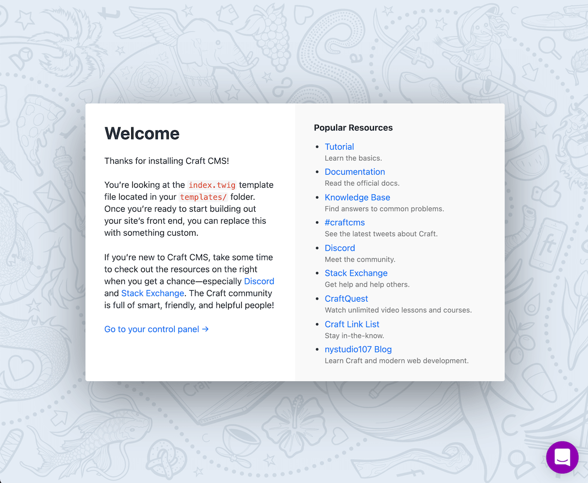
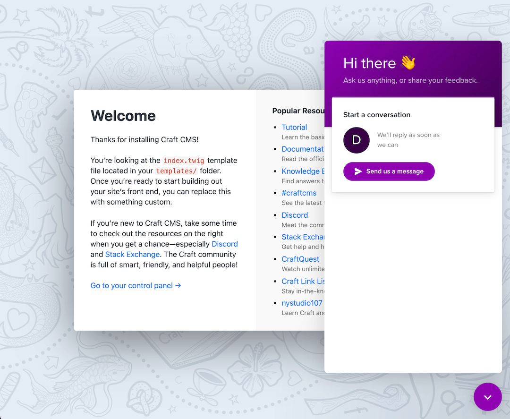
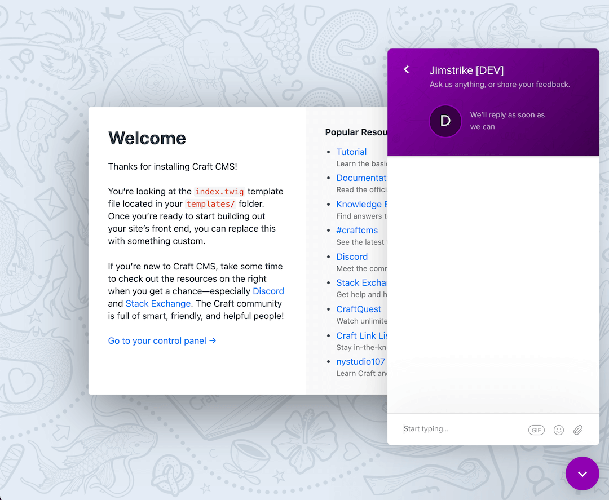

# Intercom Messenger plugin for Craft CMS 3.x

This is Intercom: the Business Messenger you and your customers will love


## Overview

Sure, it does live chat. But there’s also bots, apps, product tours, and more
like email, messages, and a help center that help you build relationships with your customers.

For more information visit: [Intercom.com](https://www.intercom.com/).

## Requirements

This plugin requires Craft CMS 3.0.0 or later.

You will need an Intercom [trial](https://www.intercom.com/pricing) or [subscription](https://www.intercom.com/pricing) in order to use this plugin. Or you can create a free [developer account](https://app.intercom.com/a/developer-signup) to build and test Intercom Messenger in development environment before signing up for a subcription.

For more information visit [Intercom.com](https://www.intercom.com/).

## Installation

### From the Plugin Store

Go to the Plugin Store in your project’s Control Panel and search for "Intercom Messenger". Then click on the "Install" button.

### With Composer

```bash
# Go to project directory
cd /path/to/my/craft-project

# Tell Composer to load the plugin
composer require jimstrike/craft-intercom-messenger

# Tell Craft to install the plugin
./craft plugin/install intercom-messenger
```

## Setting up and customizing your Messenger to start chatting with customers

Before enabling this plugin in Craft control panel you will need to setup and customize your Messenger on [Intercom](https://www.intercom.com/).

As a requirement you will need an Intercom [trial](https://www.intercom.com/pricing) or [subscription](https://www.intercom.com/pricing) in order to use this plugin. Or you can create a free [developer account](https://app.intercom.com/a/developer-signup) to build and test Intercom Messenger in development environment before signing up for a subcription.

Here's a collection of links that will help you get started with [Intercom](https://www.intercom.com/):

- [Homepage](https://www.intercom.com/)
- [About Messenger](https://www.intercom.com/help/en/collections/2094767-the-intercom-messenger)
- [Find your app ID](https://www.intercom.com/help/en/articles/3539-where-can-i-find-my-workspace-id-app-id)
- [List trusted domains](https://www.intercom.com/help/en/articles/4418-list-trusted-domains-you-use-with-intercom)
- [Identity verification](https://www.intercom.com/help/en/articles/183-enable-identity-verification-for-web-and-mobile)
- [Customize basics](https://www.intercom.com/help/en/articles/178-customize-the-intercom-messenger-basics)
- [Developer account](https://app.intercom.com/a/developer-signup)
- [Help center](https://www.intercom.com/help)

## Using "Intercom Messenger" on your site

After you have setup and customized the Messenger on Intercom go to "Intercom Messenger" site settings in your Craft control panel, follow the instructions and enable it.

## Advanced configuration

> for Craft developers

### Override settings

Copy plugin's `src/config.php` to your project's `config` folder as `intercom-messenger.php` and make your changes there to override default settings.

### Insert Intercom Messenger chat in twig templates

```twig
{##
 # @param int|null siteId (defaults to current site ID)
 # @param bool wrap (whether to wrap with <script>...</script> tag)
 #
 # @return string (Intercom Messenger chat script)
 #}
intercom_messenger_script(int siteId = null, bool wrap = false)
craft['intercom-messenger'].script(int siteId = null, bool wrap = false)
```

> **Note:**
To avoid code duplication, script will be inserted only if plugin is disabled in `Intercom Messenger → Site Settings` or `"config/intercom-messenger.php"` file.

### Twig examples

```twig
{## 
 # Insert inside twig js tag.
 #}

    {{ intercom_messenger_script(currentSite.id)|raw }}
    {#{ craft['intercom-messenger'].script(currentSite.id)|raw }#}


{##  
 # Insert before </body> ending tag.
 #
 # Passing the second parameter and setting it to true  
 # will wrap the code with html <script>...</script> tags.
 #}
{{ intercom_messenger_script(currentSite.id, true)|raw }}
{#{ craft['intercom-messenger'].script(currentSite.id, true)|raw }#}

{##  
 # Insert before </body> ending tag.
 #
 # Omit the second parameter or set it to false 
 # and place the code inside html <script>...</script> tags.
 #}
<script>
    {{ intercom_messenger_script(currentSite.id)|raw }}
    {#{ craft['intercom-messenger'].script(currentSite.id)|raw }#}
</script>
```

> **Note:**
Checks against "Enabled", "Sections" and "URL paths" won't be made as you are in control of your twig templates.

### Custom launcher

To enable a custom launcher add the tag attribute (see below) to the HTML element that you want the Messenger to open when clicked. Add as many custom launchers to your website as you wish.

You can choose to disable the standard launcher so that only your custom launcher appears.

```twig
{## 
 # Use one of the following twig functions 
 # to generate the tag attribute for the HTML element that you want 
 # the Messenger to open when clicked.
 #}
{{ intercom_messenger_custom_launcher_selector() }}
{{ craft['intercom-messenger'].customLauncherSelector() }}

{# Example 1 #}
<a href="mailto:help@your-app.com" {{ intercom_messenger_custom_launcher_selector() }}>Support</a>

{# Example 2 #}
<a href="mailto:help@your-app.com" {{ craft['intercom-messenger'].customLauncherSelector() }}>Support</a>

{# The above examples will produce something like this #}
<a href="mailto:help@your-app.com" ns-intercom-messenger-custom-launcher>Support</a>
```

> **Note**: You need to enable custom launcher in `Intercom Messenger → Site Settings` or `"config/intercom-messenger.php"` file before you can use this feature.

## Screenshots




